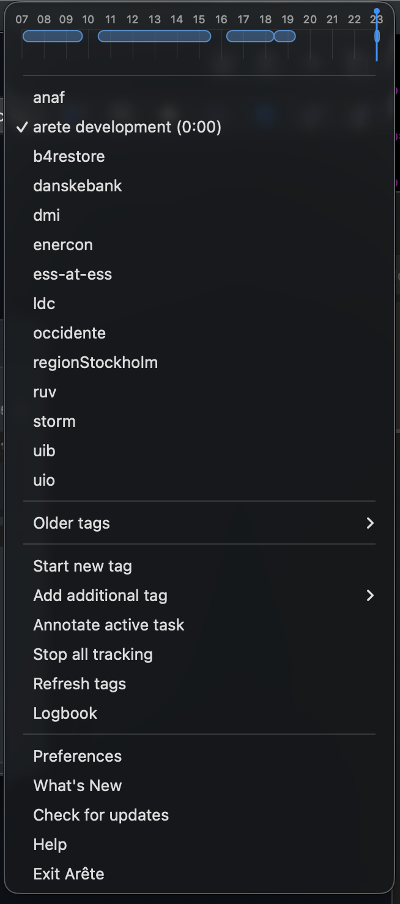
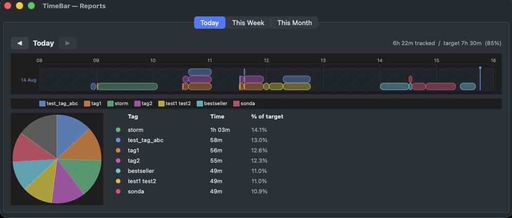

#  Arête — Time Tracker

**TimeWarrior for your macOS menu bar.**

Track your time from the macOS menu bar — no terminal required. Arête works fully standalone out of the box (with a bundled `timew` binary) and integrates seamlessly with an existing [TimeWarrior](https://timewarrior.net/) installation if you have one.



## Features

- **Live Daily Timeline Graph**: Renders a visual horizontal timeline of today's tracked intervals directly inside the top of the applet's dropdown menu, complete with multi-row packing for simultaneous tasks and a live moving blue vertical "current time" indicator line.
- Displays the currently tracked tags in the menu bar title.
- Shows all known tags as a checkable list.
- Click a tag to **switch** tracking to that tag only (stops any other active tags).
- **⌥ Option-click** a tag to **add** it to the currently running tags without stopping others.
- **Pause on screen lock**: Optionally stop active tracking when macOS is locked and automatically resume tracking those exact tags when unlocked.
- **Start at login**: Optionally register the packaged app to launch automatically when you sign in to macOS.
- **Stop all** stops all tracking with a single click.
- **Refresh tags** re-reads the tag list (useful after adding new ones).
- Auto-refreshes every 5 seconds.
- **Show Reports**: Opens a graphical history viewer with day, week, and month views showing a timeline, pie chart, and tag summary table.

## Reports

The **Show Reports…** menu entry opens a companion window with graphical summaries of your tracked time:



- **Day / Week / Month tabs** — switch between views, each with independent prev/next navigation to browse history.
- **Timeline** — horizontal bar chart of all tracked intervals, scaled to the actual hours worked.
- **Pie chart** — proportion of each tag against the work-day target (7.5 h/day, Mon–Fri).
- **Tag summary table** — time per tag and percentage of target.
- Right-click on the table or timeline graph for CSV export or raw data access.

## Requirements

- macOS
- Python 3 with the `rumps` library installed (e.g., `pip install rumps`)

## Running from the terminal

```sh
python3 arete.py
```

## Packaging as a macOS Application (DMG)

To package Arête as a standalone macOS `.app` bundle inside a drag-and-drop `.dmg` installer, just run:

```
make
```

The script is fully self-contained: it creates an isolated virtual environment, installs all build dependencies (`py2app`, `rumps`, `pyobjc`, …) into it, compiles TimeWarrior from source, and bundles everything — including the Python interpreter — inside the `.app`. No prior dependencies is needed.

This generates a mountable `dist/Arete.dmg` containing the application and a shortcut to the macOS `Applications` directory for effortless drag-and-drop installation.

Precompiled Arete.dmg is available from [https://tanso.net/Arete.dmg](https://tanso.net/Arete.dmg). but beware that this is not signed, and macOS security may block it from launching the first time with an "unidentified developer" warning. To run it, open macOS **System Settings**, go to **Privacy & Security**, scroll down to the *Security* section, and click **Open Anyway**.

## How it works

| Action | What happens |
|---|---|
| Click an **unchecked** tag | `timew start <tag>` — switches to that tag only |
| **⌥ Option-click** an **unchecked** tag | `timew start <all active tags> <new tag>` — adds tag to current tracking |
| Click a **checked** tag | removes it; if others remain `timew start <remaining>`; if none `timew stop` |
| **Stop all** | `timew stop` |

Tracking state is polled every 5 seconds so the title stays in sync even if you run `timew` commands in a terminal.

### Configuration

Arête includes a fully native **Preferences & About** window (available via **Preferences...** in the dropdown menu) that displays application/author details alongside user configuration options:

- **Pause on screen lock**: When enabled, stops tracking when the screen locks, and resumes tracking active tags when unlocked. (Saves to `"pause_on_lock"`).
- **Start at login**: Dynamically registers or removes `Arete.app` from the macOS *System Settings → General → Login Items* list via AppleScript. (Visible only when running the packaged `.app` bundle.)
- **Recent tags range**: Specifies the range passed to `timew tags <range>` to select which tags are displayed directly in the primary menu (e.g., `":month"`, `":week"`, `":fortnight"` or `"from 2026-08-01"`). (Saves to `"recent_range"`).

All user preferences (except login registration which is managed via macOS System Events) are persistently saved to `~/.arete.json`:

```json
{
  "pause_on_lock": true,
  "recent_range": ":month"
}
```

## Project layout

```
Makefile            # Makefile for building timew binary, icons and DMG file.
arete.py            # The applet (includes in-process reports window)
timereport.py       # Graphical history reports viewer (loaded in-process by arete.py;
                    #   can also be run standalone: python3 timereport.py)
setup.py            # macOS application packaging configuration
generate_icon.py    # Script to programmatically generate the high-res macOS Arete.icns file
README.md
```
